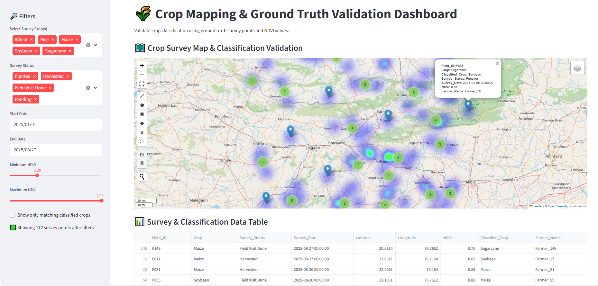

# 🌾 Crop Mapping & Ground Truth Validation Dashboard

An **interactive Streamlit web app** to validate crop classification using **ground truth survey points** and **NDVI values**.  

🌐 **Live Demo**: [Your Streamlit App URL](https://crop-mapping-survey.streamlit.app/)

Here’s the dashboard in action 👇


---

## ✨ Key Features
- Interactive map showing survey points and classification validation
- Clustered markers with popups: Field ID, Crop, Classified Crop, Survey Status, Survey Date, NDVI, Farmer Name
- NDVI Heatmap overlay
- Filters:
  - Crop type  
  - Survey status  
  - Date range  
  - NDVI range  
  - Show only matching classified crops
- Summary statistics: total points, unique fields, matching crop points, average NDVI
- Data table with sorting and CSV download
- Charts:
  - Crop distribution  
  - Survey vs classified match count  
  - NDVI distribution per crop  
  - Survey timeline

---

## 🛠️ Tech Stack
- **Frontend / Dashboard** → Streamlit  
- **Mapping / GIS** → Leafmap (Folium-based)  
- **Data Handling** → Pandas, NumPy  
- **Visualization** → Plotly Express  

---

## 📌 Use Cases
- Validate crop classification results with ground truth surveys  
- Analyze NDVI trends for different crops  
- Monitor survey coverage and status  
- Educational tool for agricultural GIS and remote sensing  

---

## 💡 Future Improvements
- Integrate **real NDVI raster layers** from Sentinel-2  
- Add **real-time survey uploads**  
- Mobile-friendly layout for field use  
- Interactive comparison with historical crop data  

---

## 🚀 Installation & Run Locally
```bash
git clone https://github.com/your-username/crop-mapping-validation-dashboard.git
cd crop-mapping-validation-dashboard
pip install -r requirements.txt
streamlit run app.py
